# Housing Affordability in Europe: What the Numbers Hide
### Time Series Clustering and Affordability Analysis, 2010–2025

🌐 **[View Project Website](https://europe-housing-affordability.lovable.app/)** 
---

## Overview

Analysis of housing price dynamics and affordability across European countries from 2010 to 2025 using Eurostat data. Nominal and inflation-adjusted house price indices are clustered using TimeSeriesKMeans to identify structurally similar housing markets. A custom affordability index — the ratio of real compensation per employee to the real house price index, both rebased to 2010 = 100 — tracks changes in purchasing power relative to housing costs.

**Key finding:** Bulgaria presents the most structurally contradictory case — a strong affordability index driven by rapid wage catch-up growth, yet with absolute compensation levels that remain the lowest in Europe throughout the entire period.

---

## Key Findings

- Estonia, Hungary, Lithuania and Iceland recorded the highest nominal price growth, with indices reaching 300–400 by 2025
- Across most of Europe, affordability has declined — real house prices have outpaced real wage growth since 2010
- Bulgaria's affordability index of ~150 reflects a base effect, not genuine purchasing power
- Housing market behaviour is driven by macroeconomic dynamics, not geographic proximity

---

## Tech Stack

`Python` `pandas` `NumPy` `tslearn` `GeoPandas` `Matplotlib` `Eurostat`

---

## Repository Structure

```
├── /scripts       # Python analysis scripts
├── /charts        # Exported chart images
├── /data          # See data/README.md for dataset links
└── README.md
```

---

## Methodology

- **Feature engineering:** HICP deflation, per-employee normalisation, 2010 rebasing, custom affordability index construction
- **Clustering:** TimeSeriesKMeans with iterative k-selection; Euclidean distance metric selected over DTW for level-based trajectory comparison
- **Validation:** Silhouette score of 0.37 — moderate meaningful separation, consistent with expected overlap in macroeconomic time series
- **Geographic analysis:** GeoPandas visualisation used to test and reject spatial autocorrelation in cluster assignments

---

## Custom Functions
**rebase()** — Rebases each country's index so the first observation equals 100, enabling consistent relative comparison across countries regardless of their starting price level. Applied to both the house price index and compensation series.

**long_format()** — Converts HPI and compensation data from wide format (countries as rows, time periods as columns) to long format (one row per country per quarter), with automatic period parsing and numeric coercion for downstream analysis.

**long_format_hicp()** — Variant of the above tailored for HICP data, handling monthly datetime parsing separately before quarterly aggregation, accounting for the different source frequency of the inflation dataset.

**plot_by_country()** — Generic time series plotting function that iterates over all countries in a dataset, assigns a distinct color per country from a 20-color palette, and standardises axis labels and tick positions across all charts in the project.

**plot_by_group()** — Extends plot_by_country() to produce one chart per cluster or region, iterating over a group dictionary and dynamically setting the title based on whether the grouping is cluster-based or geographic.

**assign_cluster()** — Maps TimeSeriesKMeans output labels back to country names, returning a dictionary of cluster-to-country assignments used for all subsequent visualisation and analysis.

---
## Results

### Nominal House Price Clusters

| | |
|---|---|
| 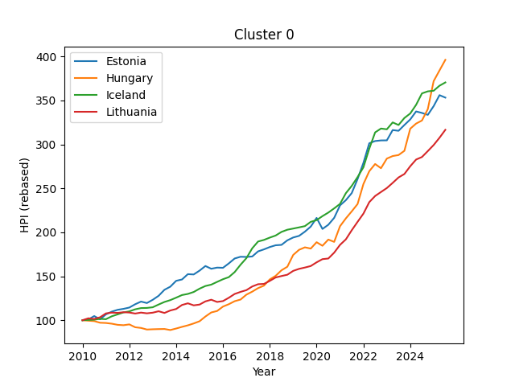 | 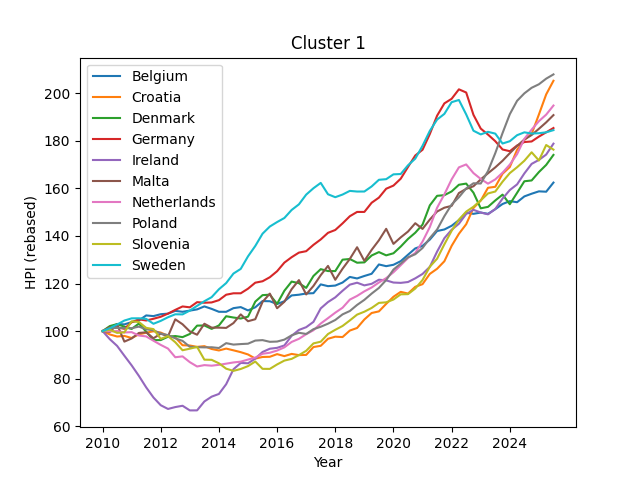 |
| **Cluster 0 — Extreme Growth** | **Cluster 1 — Recovery Markets** |
| 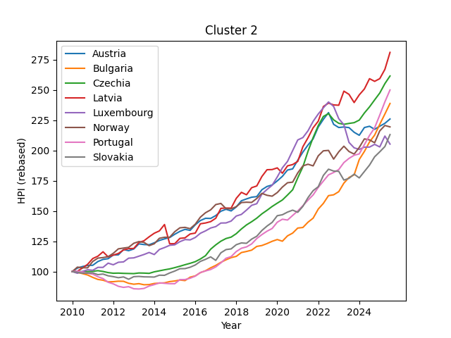 | 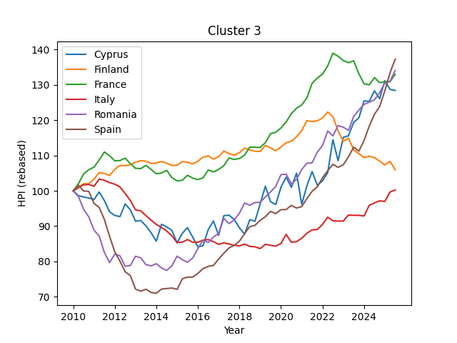 |
| **Cluster 2 — Consistent Growth** | **Cluster 3 — Crisis-Scarred Markets** |

### Inflation-Adjusted Clusters

| | |
|---|---|
| 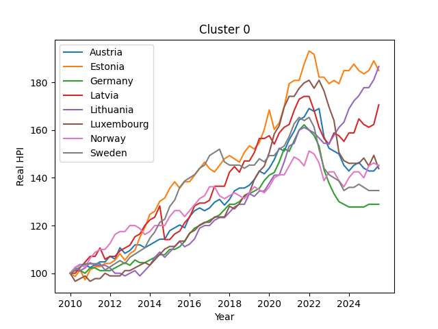 | 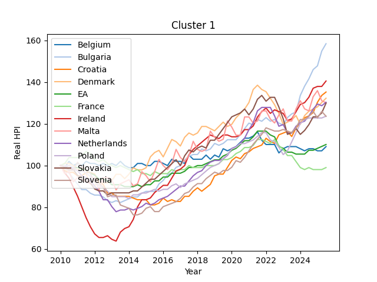 |
| **Cluster 0** | **Cluster 1** |
| 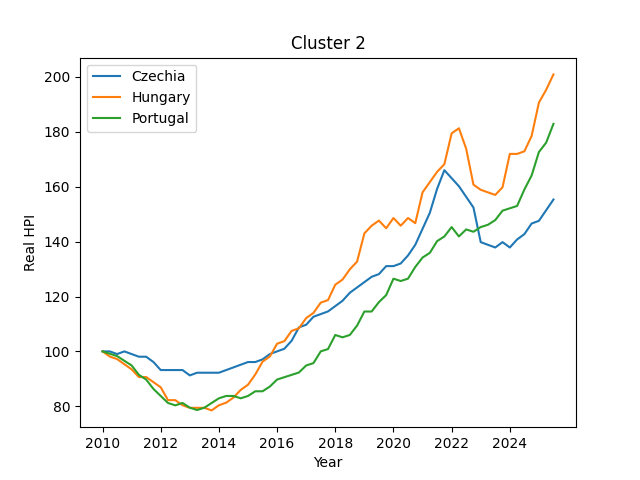 | 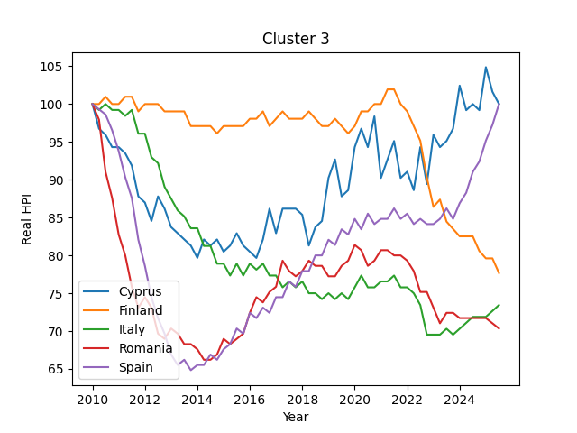 |
| **Cluster 2** | **Cluster 3** |

### Affordability Index
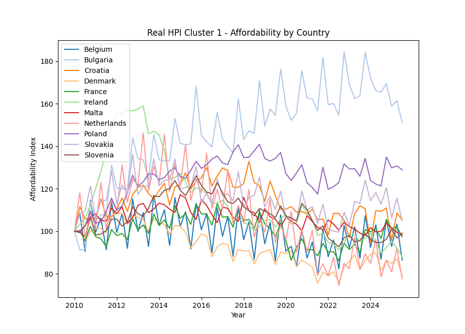

### Bulgaria: Real Compensation vs Real House Prices
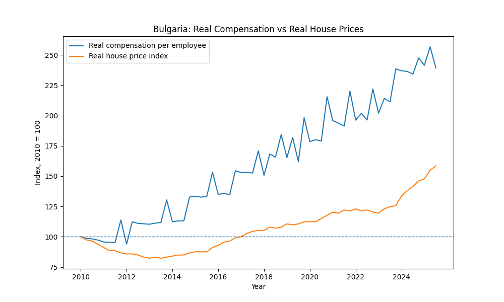

### Geographic Distribution of Affordability Clusters
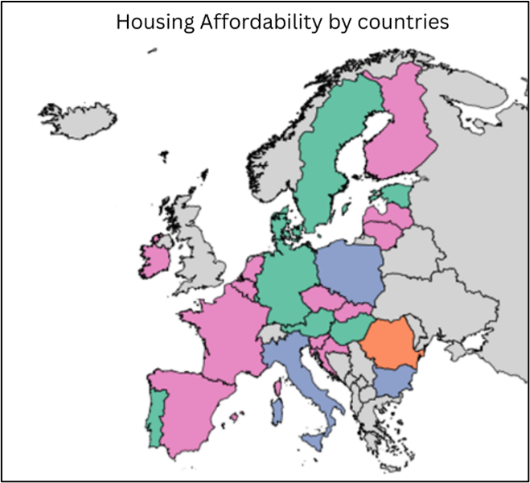

---

## Limitations

- Relative indices mask absolute level differences — Bulgaria's strong index hides a critically low wage base
- Bulgarian HPI may understate actual market prices due to historically underreported transactions
- The affordability index does not account for mortgage rates, household size or other structural factors
- Results are sensitive to the chosen number of clusters

---

*Data Mining Course Project — Plamena Pavlova, 2026*
